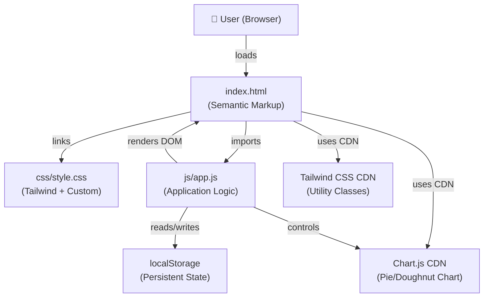
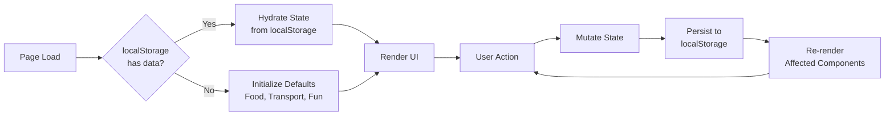
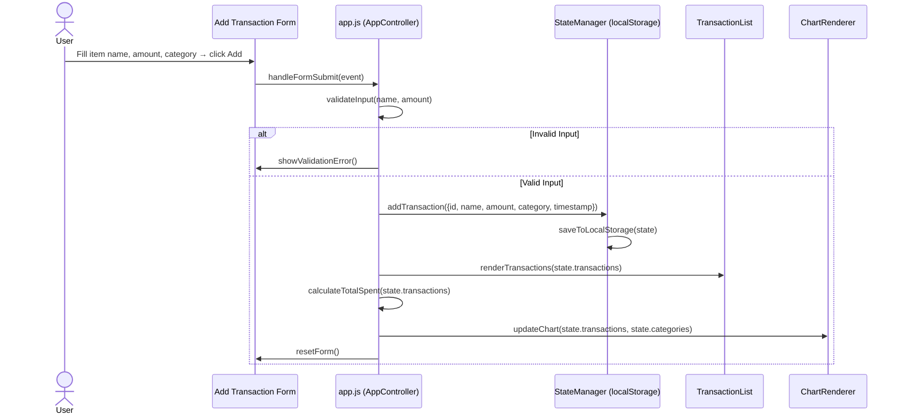
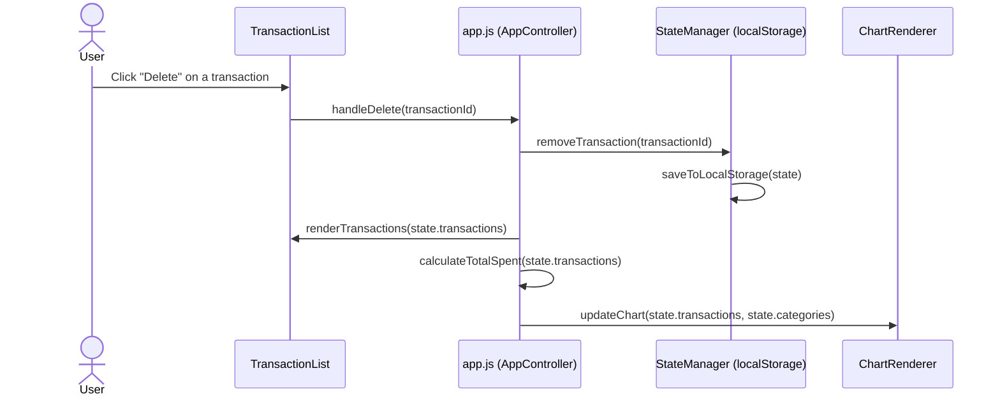
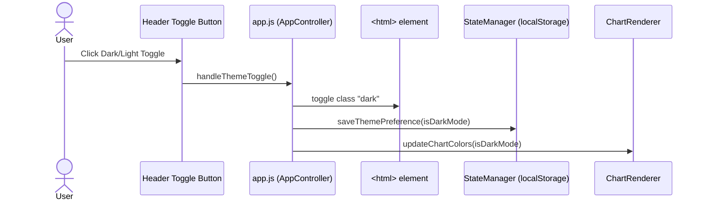

# Design Document: Expense & Budget Visualizer

## Overview

The Expense & Budget Visualizer is a client-side single-page application (SPA) that lets users log, categorize, and visualize personal spending using only vanilla HTML, CSS, and JavaScript — no frameworks, no backend. All state (transactions, categories, theme preference) is persisted in the browser's `localStorage`, and spending is presented as a live-updating Chart.js Pie/Doughnut chart alongside a sortable transaction list.

The application is structured across three files: `index.html` for semantic markup, `css/style.css` for Tailwind-augmented custom styles, and `js/app.js` for all application logic. The UI uses a responsive 3-column grid on desktop that collapses to a stacked single-column layout on mobile, ensuring usability across all screen sizes.

The core design philosophy is progressive enhancement with zero dependencies beyond two CDN-delivered libraries (Tailwind CSS and Chart.js). The app must remain fully functional offline after first load, and all user data must survive page refreshes via `localStorage`.

---

## Architecture



### State Flow



---

## Sequence Diagrams

### Add Transaction Flow



### Delete Transaction Flow



### Theme Toggle Flow



### Add Custom Category Flow

```mermaid
sequenceDiagram
    actor User
    participant Link as "Add Custom Category" link
    participant App as app.js (AppController)
    participant Browser as window.prompt()
    participant Store as StateManager (localStorage)
    participant Select as Category <select>

    User->>Link: Click "Add Custom Category"
    Link->>App: handleAddCategory()
    App->>Browser: prompt("Enter new category name")
    Browser-->>App: categoryName (string | null)
    alt User cancelled or empty string
        App->>App: do nothing
    else Valid category name
        App->>Store: addCategory(categoryName)
        Store->>Store: saveToLocalStorage(state)
        App->>Select: appendOption(categoryName)
    end
```

---

## Components and Interfaces

### Component 1: AppController (`app.js` — entry point)

**Purpose**: Bootstraps the application, wires event listeners, and orchestrates all state mutations and re-renders.

**Interface**:
```javascript
/**
 * Initializes the app on DOMContentLoaded.
 * Loads state from localStorage, renders all components,
 * and attaches all event listeners.
 */
function init(): void

/**
 * Handles the Add Transaction form submission.
 * Validates input, creates a new transaction object,
 * updates state, re-renders list + chart + total.
 */
function handleFormSubmit(event: SubmitEvent): void

/**
 * Handles deletion of a transaction by ID.
 * Filters it out of state, re-renders list + chart + total.
 */
function handleDelete(transactionId: string): void

/**
 * Handles the sort dropdown change.
 * Re-renders the transaction list in the selected order.
 */
function handleSortChange(event: Event): void

/**
 * Handles dark/light mode toggle.
 * Toggles "dark" class on <html>, persists preference,
 * updates Chart.js colors.
 */
function handleThemeToggle(): void

/**
 * Handles "Add Custom Category" link click.
 * Prompts user, validates input, adds to state and <select>.
 */
function handleAddCategory(): void
```

**Responsibilities**:
- Boot and hydration sequence
- Event listener registration
- Delegating all state mutations to StateManager
- Triggering re-renders after each mutation

---

### Component 2: StateManager (`app.js` — state module)

**Purpose**: Owns all application state and provides the sole interface for reading and writing `localStorage`.

**Interface**:
```javascript
/**
 * Loads state from localStorage.
 * Returns default state if nothing is stored.
 */
function loadState(): AppState

/**
 * Persists the current state object to localStorage.
 */
function saveState(state: AppState): void

/**
 * Adds a new transaction to state and persists.
 */
function addTransaction(state: AppState, transaction: Transaction): AppState

/**
 * Removes a transaction by ID from state and persists.
 */
function removeTransaction(state: AppState, id: string): AppState

/**
 * Adds a new category name to state and persists.
 */
function addCategory(state: AppState, categoryName: string): AppState

/**
 * Saves isDarkMode preference and persists.
 */
function saveThemePreference(state: AppState, isDark: boolean): AppState
```

**Responsibilities**:
- Single source of truth for all application data
- All `localStorage.getItem` / `localStorage.setItem` calls happen here
- JSON serialization/deserialization

---

### Component 3: TransactionListRenderer (`app.js` — render module)

**Purpose**: Renders the scrollable, sorted transaction list into the DOM.

**Interface**:
```javascript
/**
 * Renders all transactions into the list container.
 * Applies the current sort order before rendering.
 * Each item has: item name, amount, category tag, delete button.
 */
function renderTransactions(transactions: Transaction[], sortOrder: SortOrder): void

/**
 * Sorts a transaction array by the given sort order.
 * Returns a NEW sorted array (does not mutate original).
 */
function sortTransactions(transactions: Transaction[], sortOrder: SortOrder): Transaction[]

/**
 * Calculates and updates the displayed total spent value.
 */
function renderTotal(transactions: Transaction[]): void
```

**Responsibilities**:
- Generating transaction list item HTML
- Applying sort ordering
- Injecting delete button `data-id` attributes for event delegation
- Rendering empty state message when list is empty

---

### Component 4: ChartRenderer (`app.js` — chart module)

**Purpose**: Creates and updates the Chart.js Pie/Doughnut chart reflecting spending by category.

**Interface**:
```javascript
/**
 * Initializes a new Chart.js Doughnut chart on the canvas element.
 * Called once on app init.
 */
function initChart(canvasId: string, isDarkMode: boolean): Chart

/**
 * Aggregates transactions by category and updates
 * the chart's data and colors. Called after every mutation.
 */
function updateChart(chart: Chart, transactions: Transaction[], categories: string[], isDarkMode: boolean): void

/**
 * Updates chart legend/label text colors based on theme.
 * Called on theme toggle without re-aggregating data.
 */
function updateChartColors(chart: Chart, isDarkMode: boolean): void
```

**Responsibilities**:
- Chart instance lifecycle (create, update, destroy-if-needed)
- Aggregating transaction amounts by category for chart data
- Generating a consistent color palette for categories
- Adapting text/label colors for dark vs. light theme

---

## Data Models

### AppState

```javascript
/**
 * Root state object — the shape of data in localStorage.
 */
const AppState = {
  transactions: Transaction[],   // ordered by insertion (newest first internally)
  categories: string[],          // e.g. ["Food", "Transport", "Fun"]
  isDarkMode: boolean            // persisted theme preference
}
```

### Transaction

```javascript
/**
 * A single expense entry.
 */
const Transaction = {
  id: string,          // crypto.randomUUID() or Date.now().toString()
  name: string,        // item name, non-empty, max 100 chars
  amount: number,      // positive float, > 0
  category: string,    // must match one of AppState.categories
  timestamp: number    // Date.now() at time of creation
}
```

### SortOrder

```javascript
/**
 * Valid values for the sort dropdown.
 */
type SortOrder = "newest" | "oldest" | "amount-high" | "amount-low"
```

**Validation Rules**:
- `name`: non-empty string, trimmed length > 0, max 100 characters
- `amount`: numeric value, must be > 0, parsed as `parseFloat`
- `category`: must exist in `AppState.categories` at time of submission
- `timestamp`: auto-generated, not user-editable
- `id`: auto-generated, not user-editable

---

## Algorithmic Pseudocode

### Main Algorithm: Application Boot

```pascal
ALGORITHM init()
INPUT: none (reads from DOM and localStorage)
OUTPUT: fully rendered, interactive application

BEGIN
  state ← loadState()
  
  IF state.isDarkMode THEN
    ADD class "dark" TO html element
  END IF
  
  populateCategorySelect(state.categories)
  renderTotal(state.transactions)
  renderTransactions(state.transactions, "newest")
  
  chart ← initChart("spendingChart", state.isDarkMode)
  updateChart(chart, state.transactions, state.categories, state.isDarkMode)
  
  ATTACH handleFormSubmit TO form "submit" event
  ATTACH handleDelete TO list container "click" event (delegated)
  ATTACH handleSortChange TO sort select "change" event
  ATTACH handleThemeToggle TO theme toggle button "click" event
  ATTACH handleAddCategory TO "Add Custom Category" link "click" event
END
```

**Preconditions:**
- DOM is fully loaded (`DOMContentLoaded` has fired)
- `localStorage` is accessible
- Chart.js library is loaded from CDN

**Postconditions:**
- All UI components reflect current state
- All user interactions are handled
- Chart displays correct spending distribution

---

### Algorithm: Add Transaction

```pascal
ALGORITHM handleFormSubmit(event)
INPUT: event (SubmitEvent from the Add Transaction form)
OUTPUT: updated state, re-rendered UI components

BEGIN
  CALL event.preventDefault()
  
  name   ← TRIM value of input#item-name
  amount ← PARSE_FLOAT value of input#item-amount
  category ← value of select#item-category
  
  // Validation
  IF name = "" THEN
    SHOW error "Item name is required"
    RETURN
  END IF
  
  IF amount ≤ 0 OR amount IS NaN THEN
    SHOW error "Amount must be a positive number"
    RETURN
  END IF
  
  // Build transaction
  transaction ← {
    id:        generateId(),
    name:      name,
    amount:    amount,
    category:  category,
    timestamp: Date.now()
  }
  
  state ← addTransaction(state, transaction)
  saveState(state)
  
  renderTotal(state.transactions)
  renderTransactions(state.transactions, currentSortOrder)
  updateChart(chart, state.transactions, state.categories, state.isDarkMode)
  
  RESET form fields to empty/default
END
```

**Preconditions:**
- Form is rendered with valid `name`, `amount`, and `category` inputs
- `state` and `chart` are initialized

**Postconditions:**
- New transaction appears at the correct sort position in the list
- Total spent is updated
- Chart reflects new category distribution
- Form is reset to empty state

**Loop Invariants:** N/A (no loops in this algorithm)

---

### Algorithm: Sort Transactions

```pascal
ALGORITHM sortTransactions(transactions, sortOrder)
INPUT:  transactions — array of Transaction objects
        sortOrder    — one of "newest" | "oldest" | "amount-high" | "amount-low"
OUTPUT: sorted — a NEW array (original array NOT mutated)

BEGIN
  sorted ← COPY of transactions  // shallow copy via slice()
  
  IF sortOrder = "newest" THEN
    SORT sorted BY timestamp DESCENDING
  ELSE IF sortOrder = "oldest" THEN
    SORT sorted BY timestamp ASCENDING
  ELSE IF sortOrder = "amount-high" THEN
    SORT sorted BY amount DESCENDING
  ELSE IF sortOrder = "amount-low" THEN
    SORT sorted BY amount ASCENDING
  END IF
  
  RETURN sorted
END
```

**Preconditions:**
- `transactions` is a (possibly empty) array of Transaction objects
- `sortOrder` is one of the four valid string values

**Postconditions:**
- Returns a new array; original `transactions` array is unmodified
- All elements of the input appear in the output (no filtering)
- Sort order is deterministic for equal values (stable sort)

**Loop Invariants:** Sort comparator is applied uniformly to all pairs

---

### Algorithm: Aggregate Spending by Category

```pascal
ALGORITHM aggregateByCategory(transactions, categories)
INPUT:  transactions — array of Transaction objects
        categories   — array of category name strings
OUTPUT: totals — object mapping category name → total amount spent

BEGIN
  totals ← {}
  
  FOR each category IN categories DO
    totals[category] ← 0
  END FOR
  
  FOR each transaction IN transactions DO
    IF totals[transaction.category] EXISTS THEN
      totals[transaction.category] ← totals[transaction.category] + transaction.amount
    END IF
  END FOR
  
  RETURN totals
END
```

**Preconditions:**
- `transactions` may be empty (returns zero-filled totals)
- `categories` is a non-empty array of strings

**Postconditions:**
- Every category in `categories` has an entry in `totals`
- Each entry is a non-negative float
- Transactions with categories not in `categories` are ignored (defensive)

**Loop Invariants:**
- After inner loop iteration i: all transactions[0..i] have been accumulated
- `totals[c] ≥ 0` for all c throughout execution

---

### Algorithm: Load State from localStorage

```pascal
ALGORITHM loadState()
INPUT: none
OUTPUT: AppState object

BEGIN
  raw ← localStorage.getItem("expense-app-state")
  
  IF raw IS null THEN
    RETURN {
      transactions: [],
      categories:   ["Food", "Transport", "Fun"],
      isDarkMode:   false
    }
  END IF
  
  TRY
    parsed ← JSON.parse(raw)
    // Defensive defaults for any missing fields
    RETURN {
      transactions: parsed.transactions OR [],
      categories:   parsed.categories OR ["Food", "Transport", "Fun"],
      isDarkMode:   parsed.isDarkMode OR false
    }
  CATCH error
    // Corrupted data — reset to defaults
    RETURN {
      transactions: [],
      categories:   ["Food", "Transport", "Fun"],
      isDarkMode:   false
    }
  END TRY
END
```

**Preconditions:**
- `localStorage` API is available in the browser

**Postconditions:**
- Returns a valid, fully-formed `AppState` object in all cases
- Never throws; gracefully handles corrupted or missing data

---

### Algorithm: Update Chart

```pascal
ALGORITHM updateChart(chart, transactions, categories, isDarkMode)
INPUT:  chart        — Chart.js instance
        transactions — current transaction array
        categories   — current category array
        isDarkMode   — boolean
OUTPUT: chart instance mutated in-place, chart re-rendered

BEGIN
  totals ← aggregateByCategory(transactions, categories)
  
  labels ← categories WHERE totals[category] > 0
  data   ← labels MAP TO totals[label]
  colors ← generateColorPalette(labels.length)
  
  chart.data.labels   ← labels
  chart.data.datasets[0].data            ← data
  chart.data.datasets[0].backgroundColor ← colors
  
  textColor ← IF isDarkMode THEN "#e5e7eb" ELSE "#374151"
  chart.options.plugins.legend.labels.color ← textColor
  
  CALL chart.update()
END
```

**Preconditions:**
- `chart` is a valid, initialized Chart.js instance
- `transactions` and `categories` are valid arrays

**Postconditions:**
- Chart displays only categories with non-zero spending
- Colors are consistent per category (same index = same color)
- Legend text is visible against the current theme background

---

## Key Functions with Formal Specifications

### `generateId()`

```javascript
function generateId(): string
```

**Preconditions:** None

**Postconditions:**
- Returns a string that is unique for all practical purposes
- Uses `crypto.randomUUID()` if available, else `Date.now().toString() + Math.random()`
- Return value is non-empty

---

### `calculateTotalSpent(transactions)`

```javascript
function calculateTotalSpent(transactions: Transaction[]): number
```

**Preconditions:**
- `transactions` is an array (may be empty)
- Each `transaction.amount` is a positive number

**Postconditions:**
- Returns the sum of all `transaction.amount` values
- Returns `0` when `transactions` is empty
- Result is a non-negative float

---

### `generateColorPalette(count)`

```javascript
function generateColorPalette(count: number): string[]
```

**Preconditions:**
- `count` is a non-negative integer

**Postconditions:**
- Returns an array of `count` CSS color strings
- Colors are visually distinct for small counts (≤ 10)
- Returns `[]` when `count === 0`

---

## Example Usage

```javascript
// ── Boot sequence ──────────────────────────────────────────────────────
document.addEventListener("DOMContentLoaded", init);

// ── State example ──────────────────────────────────────────────────────
const exampleState = {
  transactions: [
    { id: "abc123", name: "Coffee", amount: 4.50, category: "Food", timestamp: 1700000000000 },
    { id: "def456", name: "Bus pass", amount: 25.00, category: "Transport", timestamp: 1700001000000 }
  ],
  categories: ["Food", "Transport", "Fun"],
  isDarkMode: false
};

// ── Adding a transaction ────────────────────────────────────────────────
const newTransaction = {
  id: generateId(),
  name: "Movie ticket",
  amount: 12.99,
  category: "Fun",
  timestamp: Date.now()
};
const updatedState = addTransaction(exampleState, newTransaction);
saveState(updatedState);

// ── Sorting ────────────────────────────────────────────────────────────
const sorted = sortTransactions(updatedState.transactions, "amount-high");
// sorted[0] → { name: "Bus pass", amount: 25.00 ... }

// ── Aggregation for chart ───────────────────────────────────────────────
const totals = aggregateByCategory(updatedState.transactions, updatedState.categories);
// totals → { Food: 4.50, Transport: 25.00, Fun: 12.99 }

// ── Total spent display ────────────────────────────────────────────────
const total = calculateTotalSpent(updatedState.transactions);
// total → 42.49
```

---

## Correctness Properties

### Property 1: State Persistence Roundtrip

For any valid `AppState` object `s`, `loadState()` after `saveState(s)` returns an object deeply equal to `s`. The serialization and deserialization of state must be lossless.

```javascript
// For all valid state objects s:
saveState(s);
const loaded = loadState();
assert(loaded.transactions.length === s.transactions.length);
assert(loaded.categories.join(',') === s.categories.join(','));
assert(loaded.isDarkMode === s.isDarkMode);
```

**Validates: Requirements 1.1, 1.2, 1.3**

### Property 2: Sort Non-Destructive

For any transactions array `T` and any sort order `o`, `sortTransactions(T, o).length === T.length` and no element is added or removed. The original array must remain unmodified.

```javascript
// For all T (array of transactions) and all o in [newest, oldest, amount-high, amount-low]:
const original = [...T];
const sorted = sortTransactions(T, o);
assert(sorted.length === T.length);
assert(T.every((t, i) => T[i] === original[i])); // original unmodified
assert(sorted.every(t => T.some(orig => orig.id === t.id))); // no new elements
```

**Validates: Requirements 8.5, 8.6**

### Property 3: Aggregation Completeness

For any `transactions` and `categories`, every category in `categories` appears as a key in `aggregateByCategory(transactions, categories)` with a value ≥ 0. No category produces a negative total.

```javascript
// For all categories array C and all transactions T:
const totals = aggregateByCategory(T, C);
assert(C.every(cat => cat in totals));
assert(C.every(cat => totals[cat] >= 0));
```

**Validates: Requirements 9.2, 9.3, 9.4**

### Property 4: Total Accuracy

`calculateTotalSpent(transactions)` always equals the mathematical sum of all `amount` fields. For an empty array it returns exactly 0.

```javascript
// For all T (array of transactions):
const expected = T.reduce((sum, t) => sum + t.amount, 0);
assert(calculateTotalSpent(T) === expected);
assert(calculateTotalSpent([]) === 0);
```

**Validates: Requirements 5.2, 5.5**

### Property 5: Delete Removes Exactly One

After `removeTransaction(state, id)`, the result contains exactly `state.transactions.length - 1` transactions when the id exists, and the removed transaction's `id` does not appear in the result.

```javascript
// For all states with at least one transaction, and for an id that exists:
const before = state.transactions.length;
const after = removeTransaction(state, existingId).transactions;
assert(after.length === before - 1);
assert(!after.some(t => t.id === existingId));
```

**Validates: Requirements 8.9**

### Property 6: Custom Category Uniqueness

`addCategory` is idempotent with respect to duplicates. Adding a category whose trimmed name already exists (case-insensitive) does not change `state.categories.length`.

```javascript
// For all states and all names n where n.trim().toLowerCase() already exists in categories:
const before = state.categories.length;
const after = addCategory(state, n).categories;
assert(after.length === before);
```

**Validates: Requirements 7.4**

### Property 7: Form Reset After Submit

After a successful `handleFormSubmit`, all form input values are empty or default and no validation error messages are displayed in `#form-error`.

**Validates: Requirements 6.7, 6.8**

### Property 8: Theme Persistence

After `handleThemeToggle()`, the `<html>` element class list reflects the new `isDarkMode` value, and `loadState().isDarkMode` equals that new value — confirming the change was persisted.

**Validates: Requirements 4.3, 4.4**

---

## Error Handling

### Error Scenario 1: Invalid Form Input

**Condition**: User submits the form with an empty name or non-positive/non-numeric amount.  
**Response**: Display inline validation messages adjacent to the offending input field; do not submit. Use `aria-live="polite"` regions so screen readers announce the error.  
**Recovery**: User corrects the field and resubmits. Error messages clear on next valid submission.

### Error Scenario 2: Corrupted localStorage Data

**Condition**: `JSON.parse` throws because stored data is malformed.  
**Response**: Catch the exception silently in `loadState()`, return default state (empty transactions, default categories, light mode).  
**Recovery**: App starts fresh; user's data is lost but the app remains functional.

### Error Scenario 3: Empty Category Name from Prompt

**Condition**: User clicks "Add Custom Category", opens `window.prompt`, then submits an empty string or clicks Cancel.  
**Response**: Do nothing — return early from `handleAddCategory()` without mutating state.  
**Recovery**: No action needed; the existing category list is unchanged.

### Error Scenario 4: Chart.js Not Loaded (CDN failure)

**Condition**: `Chart` global is undefined because the CDN request failed.  
**Response**: Wrap `initChart` in a guard: `if (typeof Chart === 'undefined') { /* show fallback message */ return; }`. Display a text-based summary table as fallback inside the chart card.  
**Recovery**: User reloads when connectivity is restored.

### Error Scenario 5: localStorage Quota Exceeded

**Condition**: `localStorage.setItem` throws `QuotaExceededError` (rare but possible).  
**Response**: Catch the error in `saveState()`, display a non-blocking toast/alert: "Storage limit reached. Older transactions may not be saved."  
**Recovery**: User can delete existing transactions to free up space.

---

## Testing Strategy

### Unit Testing Approach

Since the project uses no build tooling, unit tests are conceptual. Each pure function is isolated and testable by calling it directly in the browser console or a simple test script:

- `loadState()` with no localStorage entry → returns default state
- `addTransaction(state, tx)` → returns new object with `tx` appended
- `removeTransaction(state, id)` → removes exactly the matching transaction
- `sortTransactions([], "newest")` → returns `[]`
- `calculateTotalSpent([])` → returns `0`
- `aggregateByCategory([], ["Food"])` → returns `{ Food: 0 }`

### Property-Based Testing Approach

**Property Test Library**: fast-check (can be loaded via CDN for in-browser testing)

Key properties to verify:
- `sortTransactions` never changes array length
- `aggregateByCategory` always produces non-negative values
- `loadState(saveState(s))` equals `s` for any valid state
- `removeTransaction` after `addTransaction` with same ID returns original length

### Integration Testing Approach

Manual end-to-end checks in browser:
1. Add 3 transactions across different categories → chart shows 3 segments
2. Delete a transaction → chart updates, total decreases
3. Reload page → all transactions and theme persist
4. Toggle dark mode → chart legend colors update, `<html>` has `dark` class
5. Add custom category → appears in dropdown and in chart after transaction added

---

## Performance Considerations

- **Re-renders are targeted**: Only the list, total, and chart update on mutation — the full page never re-renders.
- **Chart.update()** is used (not chart destroy + recreate) to enable smooth animated transitions.
- **LocalStorage reads** happen once on boot (hydration); all subsequent reads use the in-memory `state` object.
- **Sort is applied at render time**, not stored — avoids unnecessary persistence writes.
- **No debouncing needed** for the small data volumes expected (personal expense tracker, typically < 1,000 transactions).

---

## Security Considerations

- **No server-side data**: All data stays in the user's browser. No XSS surface from network responses.
- **DOM injection risk**: Transaction `name` values are inserted into the DOM. Use `textContent` (not `innerHTML`) when rendering transaction names and category tags to prevent XSS from malicious input.
- **`window.prompt` input**: Trim and validate category name length (max 50 chars) before inserting into the DOM or `localStorage`.
- **`localStorage` is not encrypted**: Suitable for non-sensitive personal data only. Users should be aware that other scripts on the same origin can read this data.
- **CDN integrity**: Optionally add `integrity` (SRI) attributes to CDN `<script>` tags for Tailwind and Chart.js to guard against CDN compromise.

---

## Dependencies

| Dependency | Source | Version | Purpose |
|---|---|---|---|
| Tailwind CSS | CDN (`cdn.tailwindcss.com`) | Latest v3 | Utility-first styling and responsive grid |
| Chart.js | CDN (`cdn.jsdelivr.net/npm/chart.js`) | Latest v4 | Pie/Doughnut chart rendering |
| No other dependencies | — | — | Vanilla HTML/CSS/JS only |

**Folder Structure (Final)**:
```
/
├── index.html          ← Semantic HTML5 markup, CDN links
├── css/
│   └── style.css       ← Custom styles augmenting Tailwind
└── js/
    └── app.js          ← All application logic (state, render, chart)
```
